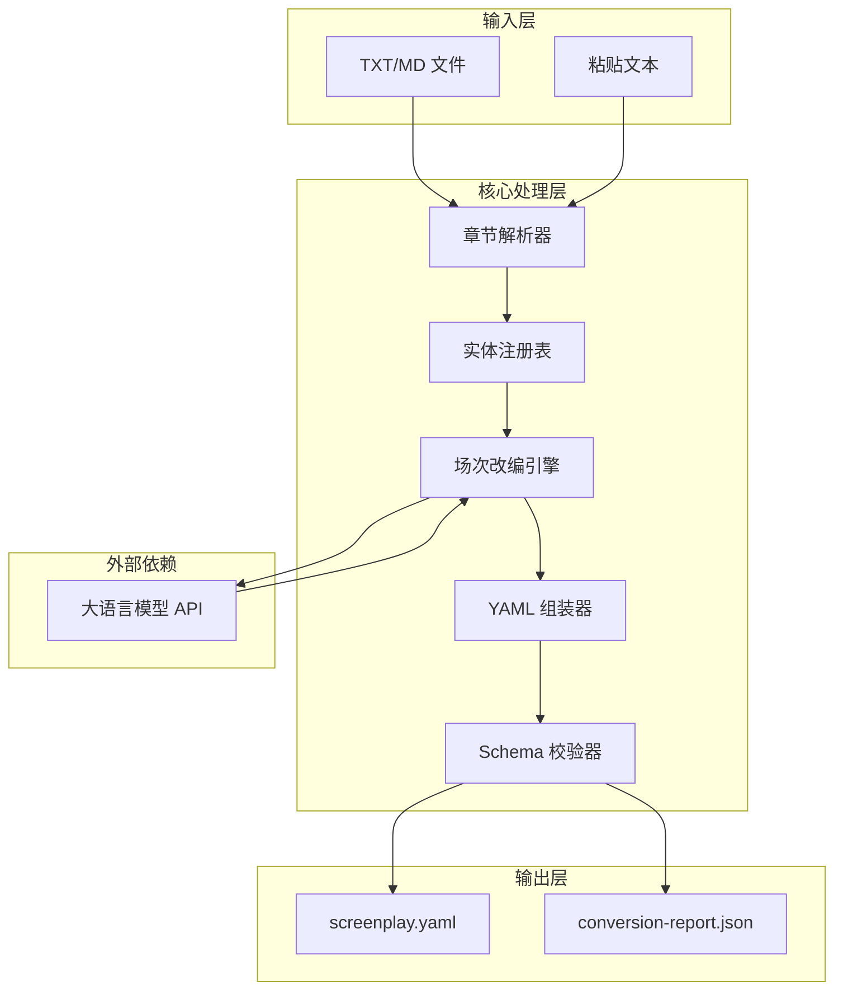
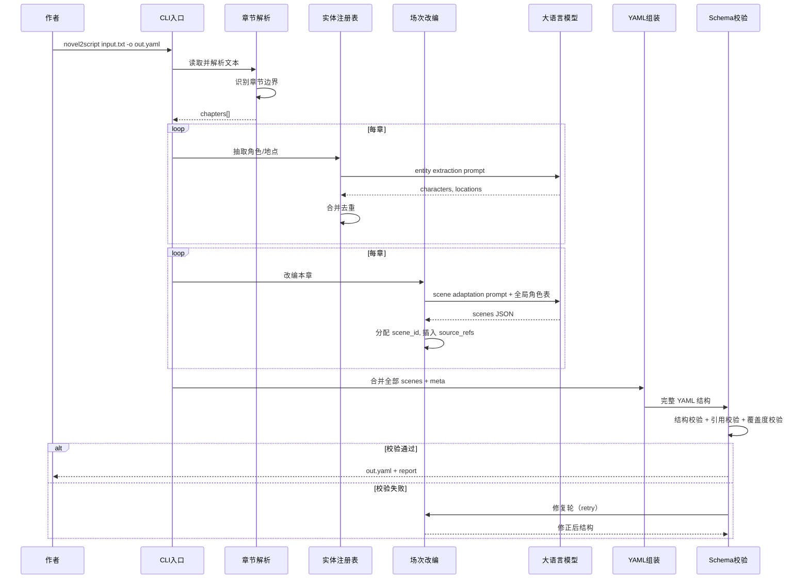
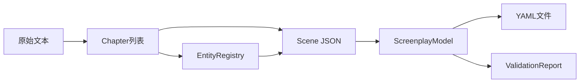

# AI 小说转剧本工具 — 完整项目文档

> 产品名称：Novel2Script  
> 版本：1.0  
> 最后更新：2026-06-05  
> 本文档合并了项目全部设计与规范文件，便于评审与提交。

---

## 目录

1. [产品需求文档（PRD）](#1-产品需求文档prd)
2. [剧本 YAML Schema 规范](#2-剧本-yaml-schema-规范)
3. [技术架构文档](#3-技术架构文档)
4. [MVP 实现计划](#4-mvp-实现计划)
5. [用户使用指南](#5-用户使用指南)
6. [示例资产说明](#6-示例资产说明)

---
# 1. 产品需求文档（PRD）

## 1.1 文档信息

| 项目 | 内容 |
|------|------|
| 产品代号 | Novel2Script |
| 文档作者 | 产品团队 |
| 目标读者 | 开发团队、评审方、作者用户 |
| 关联文档 | [YAML-SCHEMA.md](./YAML-SCHEMA.md)、[ARCHITECTURE.md](./ARCHITECTURE.md) |

---

## 2. 背景与问题陈述

### 2.1 市场背景

中国网络文学市场规模持续增长，大量 IP 寻求影视化改编。然而，从小说到剧本的转化长期依赖专业编剧手工完成，成本高、周期长，许多作者虽有改编意愿却无力承担。

### 2.2 核心痛点

| 痛点 | 具体表现 |
|------|----------|
| **叙事逻辑差异** | 小说依赖内心独白与叙述，剧本要求可视化的动作与对白 |
| **结构单元不同** | 小说按「章」组织，剧本按「场」组织，需重新划分 |
| **格式门槛** | 行业标准剧本格式（Final Draft / Fountain）学习成本高 |
| **改编周期长** | 专业编剧改编一部长篇通常需数月至一年 |
| **初稿空白焦虑** | 作者面对空白文档不知从何改起 |

### 2.3 产品机会

大语言模型（LLM）具备强大的文本理解与生成能力，可完成「叙事拆解 → 场次重组 → 对白提炼」的改编链路。将输出结构化为 YAML 格式，既便于 AI 稳定生成，又便于作者直接编辑与版本管理，形成「AI 出初稿、人类精修」的高效协作模式。

---

## 3. 产品愿景与目标

### 3.1 愿景

让每一位小说作者都能以极低成本获得可编辑、可打磨的剧本初稿，降低 IP 影视化改编的门槛。

### 3.2 产品目标（MVP）

1. 支持 **3 个章节以上** 的小说文本输入，自动转换为结构化 YAML 剧本
2. 输出符合 [YAML Schema 规范](./YAML-SCHEMA.md) 的初稿，作者可在 30 分钟内开始人工打磨
3. 保留原文溯源信息，使改编过程透明、可追溯
4. 转换成功率 ≥ 95%（Schema 校验通过）

---

## 4. 目标用户

### 4.1 用户画像

#### 用户 A：网文/出版作者

- **特征**：有已完成或连载中的小说，希望探索影视化可能
- **技能**：熟悉写作，不熟悉剧本格式
- **需求**：快速看到「我的小说变成剧本是什么样」，作为后续洽谈或自行修改的基础
- **痛点**：请不起专业编剧，不知改编从何下手

#### 用户 B：编剧/改编顾问

- **特征**：专业影视从业者，受雇于作者或制片方做改编
- **技能**：精通剧本格式与改编技巧
- **需求**：在结构化初稿基础上精修，而非从零开始
- **痛点**：阅读小说并手工划场耗时，希望 AI 完成「粗分场」

#### 用户 C：独立创作者

- **特征**：同时写小说和剧本，或计划自编自导
- **技能**：有一定剧本基础
- **需求**：验证 IP 是否适合影视化，快速出样稿给投资人或合作方看
- **痛点**：时间有限，需要在多个项目间切换

### 4.2 用户优先级

MVP 阶段优先服务 **用户 A（网文/出版作者）**，兼顾用户 B 的结构化输出需求。

---

## 5. 用户故事

### 5.1 核心用户故事

| ID | 角色 | 故事 | 优先级 |
|----|------|------|--------|
| US-01 | 作者 | 作为作者，我希望上传 3 章以上的小说文本，以便获得按场次划分的 YAML 剧本初稿 | P0 |
| US-02 | 作者 | 作为作者，我希望每一场戏都能追溯到原文章节，以便对照原文进行删改 | P0 |
| US-03 | 作者 | 作为作者，我希望 YAML 文件可直接用文本编辑器修改，以便无需学习专业软件 | P0 |
| US-04 | 作者 | 作为作者，我希望看到 AI 推断/改写的地方有明确标记，以便重点审核 | P0 |
| US-05 | 作者 | 作为作者，我希望获得转换报告（场次数、角色数、警告项），以便评估初稿规模 | P1 |
| US-06 | 编剧 | 作为编剧，我希望角色在全文中 ID 一致，以便统计戏份和检查一致性 | P1 |
| US-07 | 作者 | 作为作者，我希望 YAML 可纳入 Git 版本管理，以便与合作者协作修改 | P2 |

### 5.2 用户旅程

```
上传小说 → 等待转换 → 下载 YAML → 阅读转换报告
    → 对照 source_refs 审阅 → 编辑 YAML → （可选）导出 Fountain/PDF
```

---

## 6. 功能需求

### 6.1 MVP 功能（P0）

#### F-01 文本输入

- 支持粘贴或上传 TXT / MD 文件
- 自动识别章节边界（支持「第 X 章」「Chapter N」「# 章节名」等常见格式）
- 校验：至少 3 章，否则拒绝并提示
- 字数上限：10 万字 / 20 章（可配置）

#### F-02 AI 转换流水线

- 章节解析 → 角色/地点抽取 → 按章场次划分 → 对白/动作生成 → YAML 序列化
- 分章调用 LLM，避免超长文本 token 超限
- 跨章合并角色表，消歧别名

#### F-03 YAML 输出

- 输出符合 Schema v1.0 的 `.yaml` 文件
- 包含完整 `meta`、`characters`、`scenes`、`warnings`
- 人类可读格式（多行块标量、合理缩进）

#### F-04 Schema 校验

- 输出前自动校验结构与引用完整性
- 校验失败则重试或标记 error 级别 warning

#### F-05 转换报告

- 输出简要报告：场次数、角色数、地点数、警告数
- 列出所有 warning 供作者快速定位

### 6.2 V1.1 功能（P1/P2，MVP 后）

| 功能 | 描述 | 优先级 |
|------|------|--------|
| Fountain 导出 | YAML → `.fountain` 文件 | P1 |
| PDF 导出 | 标准剧本排版 PDF | P2 |
| Web UI | 浏览器上传 + 在线预览 | P1 |
| 场次重写 | 选中某场，AI 按指令重写 | P2 |
| 角色关系图 | 可视化角色出场关系 | P2 |
| 场次时间线 | 按时间/地点排列场次 | P2 |

---

## 7. 非功能需求

| 类别 | 要求 |
|------|------|
| **性能** | 3 章（约 1 万字）转换耗时 2–5 分钟（取决于 LLM 响应速度） |
| **可用性** | CLI 一条命令完成转换；错误信息清晰可操作 |
| **可靠性** | 转换成功率 ≥ 95%（Schema 校验 PASS 或 PASS_WITH_WARNINGS） |
| **隐私** | 支持本地模型（Ollama）部署，原文不出本地；云 API 模式需明确告知用户 |
| **可扩展性** | LLM 提供商可配置（OpenAI / 通义 / DeepSeek / Ollama） |
| **可维护性** | Pydantic 模型与 YAML Schema 文档同步维护 |

---

## 8. 成功指标

| 指标 | 目标值 | 衡量方式 |
|------|--------|----------|
| 转换成功率 | ≥ 95% | Schema 校验 PASS 比例 |
| 章节覆盖率 | 100% | 每个输入章节至少出现在一个 scene 的 source_refs |
| 作者满意度 | ≥ 4/5 | 内测用户问卷「初稿可直接编辑」评分 |
| 精修效率提升 | ≥ 50% | 对比纯手工改编，完成可提交初稿的时间 |
| 警告准确率 | ≥ 90% | 作者确认 warning 确实需要人工审核 |

---

## 9. 范围边界

### 9.1 本次做

- 中文小说 → 中文剧本（YAML）
- 3–20 章、≤10 万字
- CLI 工具 + 完整文档 + Schema 规范

### 9.2 本次不做

- 英文或其他语言（V2 考虑）
- 剧本 → 小说反向转换
- 视频/分镜生成
- 版权/授权管理
- 在线协作编辑平台

---

## 10. 竞品参考

| 产品/方案 | 优势 | 劣势 |
|-----------|------|------|
| 手工改编 | 质量最高 | 成本高、周期长 |
| ChatGPT 直接转换 | 零门槛 | 输出非结构化、无溯源、格式不稳定 |
| Final Draft 导入 | 行业标准 | 无 AI 能力，需手工输入 |
| **Novel2Script** | 结构化 YAML + 溯源 + 可编辑 + 可校验 | MVP 阶段无 Web UI |

---

## 11. 里程碑概览

详见 [MVP-PLAN.md](./MVP-PLAN.md)。

| 阶段 | 时间 | 产出 |
|------|------|------|
| M0 文档 | 第 1 周 | PRD + Schema + 示例 |
| M1 核心管道 | 第 2 周 | CLI 可用 |
| M2 质量 | 第 3 周 | 校验器 + 回归测试 |
| M3 体验 | 第 4 周 | 转换报告 + README |

---

## 12. 附录

### 12.1 术语表

| 术语 | 定义 |
|------|------|
| 场次（Scene） | 剧本的基本单元，同一时间同一地点的连续动作 |
| Slugline | 场次标题行，如「内景 客厅 - 日」 |
| Fountain | 纯文本剧本标记语言，可导出 PDF |
| 溯源（Provenance） | 剧本场次与原文章节的对应关系 |
| 外化 | 将小说叙述/内心活动转化为可见的对白或动作 |

### 12.2 参考标准

- [Fountain 剧本格式规范](https://fountain.io/syntax)
- 好莱坞标准剧本格式（Final Draft 默认）


---

# 2. 剧本 YAML Schema 规范

## 2.1 概述

本规范定义了 AI 小说转剧本工具的输出格式——**结构化 YAML 剧本**。该格式旨在：

- 让 AI 能够稳定、可校验地生成剧本初稿
- 让作者能够像编辑代码一样 diff、版本管理、协作修改
- 作为中间层，可进一步导出为 Fountain、Final Draft 等行业标准格式

---

## 2. 设计原则与设计原因

| 设计原则 | 设计原因 |
|----------|----------|
| **场次（Scene）为一等公民** | 影视制作以「场」为单位调度、拍摄、预算，而非小说的「章」。将 `scenes` 作为核心数组，使输出直接对齐生产流程。 |
| **保留原文溯源（provenance）** | AI 改编必然存在删改与推断。每场戏通过 `source_refs` 关联原文章节与段落，作者可快速对照原文，避免「黑盒改编」带来的信任问题。 |
| **角色/地点注册表** | 小说中同一人物有多种称呼（「黛玉」「林妹妹」「潇湘妃子」）。全局 `characters` 与 `locations` 表提供稳定 ID，避免每场重复定义，并支持戏份统计与一致性校验。 |
| **动作与对白分离** | 行业标准剧本将 Action（动作行）与 Dialogue（对白行）严格区分。独立 `elements` 类型使输出可映射至 Fountain 格式，也便于作者按类型批量修改。 |
| **元数据与正文分离** | `meta` 块存放标题、作者、模型版本等信息，不参与场次编辑。作者修改剧本时只需关注 `scenes`，减少误改。 |
| **warnings 显式列出** | AI 对地点、时间、对白外化等推断应透明呈现。静默省略会导致作者误以为 AI 输出即原文忠实还原。 |
| **选用 YAML 而非 JSON** | 剧本含大量多行对白与动作描述。YAML 的 `\|` 块标量支持换行，人类可读性远优于 JSON 转义字符串。 |
| **可选 acts 分层** | 长篇改编常按「幕」组织。`acts` 为可选字段，不影响短篇或单幕作品，但为长篇提供大纲视图。 |

---

## 3. 顶层结构

```yaml
schema_version: "1.0"    # 必填，Schema 版本号
meta: { ... }             # 必填，元数据
characters: [ ... ]       # 必填，角色注册表（可为空数组，但不建议）
locations: [ ... ]        # 可选，地点注册表
acts: [ ... ]             # 可选，幕结构
scenes: [ ... ]           # 必填，场次列表（至少 1 场）
warnings: [ ... ]         # 可选，转换警告
```

---

## 4. 字段定义

### 4.1 `schema_version`

| 属性 | 值 |
|------|-----|
| 类型 | `string` |
| 必填 | 是 |
| 当前值 | `"1.0"` |

标识本文件遵循的 Schema 版本，便于工具升级时做向后兼容处理。

---

### 4.2 `meta`

作品及改编过程的元信息。

```yaml
meta:
  title: string           # 必填，作品名称
  author: string          # 必填，小说原作者
  adapted_by: string      # 可选，改编者或工具标识
  source:                 # 必填，源文本信息
    format: novel         # 固定值：novel
    chapter_count: int    # 必填，源章节总数
    chapters:             # 必填，章节列表
      - id: string        # 章节 ID，如 chapter_01
        title: string     # 章节标题
        word_count: int   # 该章字数
  adaptation:             # 必填，改编信息
    created_at: string    # ISO 8601 时间戳
    model: string         # 使用的 AI 模型名称
    prompt_version: string # Prompt 模板版本
```

**设计原因**：`source.chapters` 记录输入边界，校验时可确认「是否覆盖了全部输入章节」。`adaptation` 块使同一小说多次改编的结果可对比（模型升级、Prompt 迭代）。

---

### 4.3 `characters`

角色注册表，按首次出场顺序排列。

```yaml
characters:
  - id: string                    # 必填，稳定 ID，格式：char_{拼音或英文}
    name: string                  # 必填，主要显示名
    aliases: [string]             # 可选，别名列表
    description: string           # 可选，角色简介（≤100 字）
    first_appearance:             # 可选，首次出场位置
      scene_id: string
      chapter_id: string
```

**ID 命名规范**：

- 使用小写字母、数字、下划线
- 前缀 `char_`，如 `char_lin_mo`、`char_protagonist`
- 同一人物在全文中 ID 不可变

**设计原因**：对白元素通过 `character_id` 引用角色，而非直接写名字，避免「张三/张先生/张总」被识别为三个角色。

---

### 4.4 `locations`

地点注册表。

```yaml
locations:
  - id: string                    # 必填，格式：loc_{名称拼音}
    name: string                  # 必填，地点名称
    int_ext: interior | exterior | mixed  # 必填，内/外/混合
    description: string           # 可选，地点描述
```

**设计原因**：`slugline.location_id` 引用地点 ID，`int_ext` 在地点层提供默认值，场次层可覆盖。

---

### 4.5 `acts`（可选）

按幕组织场次，适用于长篇或多幕结构。

```yaml
acts:
  - id: string          # 必填，如 act_1
    title: string       # 可选，幕标题
    scenes: [string]    # 必填，该幕包含的 scene_id 列表，有序
```

**设计原因**：章节≠幕。AI 改编时可能将多章合并为一幕，或一章拆为多幕。`acts` 提供大纲视图，不影响 `scenes` 的完整性。

---

### 4.6 `scenes`

场次列表，剧本核心内容。

```yaml
scenes:
  - id: string                    # 必填，格式：scene_{三位数字}，如 scene_001
    slugline:                     # 必填，场次标题（Scene Heading）
      int_ext: interior | exterior
      location_id: string         # 引用 locations[].id，或直接内联见下方
      location_name: string       # 若无 location_id，可内联地点名
      time_of_day: day | night | dawn | dusk | continuous | unspecified
      heading: string             # 必填，完整标题行，如「内景 林家旧宅 客厅 - 日」
    summary: string               # 可选，本场一句话概述（≤50 字）
    source_refs:                  # 必填，原文溯源（至少 1 条）
      - chapter_id: string
        excerpt: string           # 原文摘要或引用，≤200 字
        paragraph_range: [int, int]  # 可选，段落起止索引（从 0 开始）
    characters_present: [string]  # 必填，出场角色 ID 列表
    elements: [ ... ]             # 必填，场次内容元素（至少 1 个）
    estimated_duration_min: float # 可选，预估时长（分钟）
```

**slugline 设计原因**：`heading` 为人类可读的完整标题行，可直接导出为 Fountain 的 Scene Heading；结构化字段（`int_ext`、`time_of_day`）便于程序筛选「全部夜戏」等。

**source_refs 设计原因**：改编是创造性劳动，AI 初稿必须可追溯。`excerpt` 帮助作者 3 秒内定位原文上下文。

---

### 4.7 `elements`

场次内的有序内容元素。通过 `type` 字段区分类型，不同类型携带不同字段。

#### 4.7.1 `action` — 动作/环境描述

```yaml
- type: action
  text: string    # 必填，可视化的动作或环境描写，支持多行（| 块标量）
```

**设计原因**：小说中的叙述性文字需改写为「可被摄影机拍到」的内容。心理独白不应出现在 action 中，应转为 dialogue 或 voiceover。

#### 4.7.2 `dialogue` — 角色对白

```yaml
- type: dialogue
  character_id: string       # 必填，引用 characters[].id
  lines: string              # 必填，台词内容，支持多行
  parenthetical: string      # 可选，括号内语气/动作提示，如「轻声」「转向窗口」
```

**设计原因**：对标行业标准剧本格式——角色名 + 可选括号提示 + 台词。`parenthetical` 合并为 dialogue 的子字段，而非独立 element，因其从属于对白。

#### 4.7.3 `voiceover` — 画外音/旁白

```yaml
- type: voiceover
  character_id: string    # 可选，若为角色内心独白则引用角色 ID
  text: string            # 必填，旁白内容
```

**设计原因**：极少数无法外化的内心活动可保留为 V.O.，但应节制使用。独立类型便于作者统计「旁白占比」并批量删减。

#### 4.7.4 `transition` — 转场

```yaml
- type: transition
  text: string    # 必填，如「切至」「淡入」「黑屏」
```

**设计原因**：转场在 Fountain 中右对齐独立成行。独立类型便于导出时格式化。

---

### 4.8 `warnings`

AI 转换过程中产生的警告与待确认项。

```yaml
warnings:
  - code: string              # 必填，警告码（见下表）
    scene_id: string          # 可选，关联场次
    message: string           # 必填，人类可读说明
    severity: info | warning | error  # 必填
```

**警告码枚举**：

| code | severity | 含义 |
|------|----------|------|
| `LOCATION_INFERRED` | warning | 地点由 AI 推断，原文未明确 |
| `TIME_INFERRED` | warning | 时间（日/夜）由 AI 推断 |
| `DIALOGUE_SYNTHESIZED` | warning | 对白由 AI 从叙述外化，原文无直接引语 |
| `CHARACTER_MERGED` | info | 多个称呼合并为同一角色 |
| `SCENE_SPLIT` | info | 原文一段拆分为多个场次 |
| `SCENE_MERGED` | info | 原文多段合并为一个场次 |
| `INNER_MONOLOGUE_OMITTED` | info | 内心独白已省略或转为动作 |
| `MISSING_SOURCE_REF` | error | 场次缺少原文溯源 |
| `INVALID_CHARACTER_REF` | error | 引用了不存在的 character_id |

**设计原因**：透明度是 AI 工具可信度的核心。作者应明确知道「哪些是 AI 编的」。

---

## 5. 完整示例

参见 [`examples/sample-screenplay.yaml`](../examples/sample-screenplay.yaml)。

最小合法示例：

```yaml
schema_version: "1.0"

meta:
  title: "示例作品"
  author: "作者甲"
  adapted_by: "novel2script/1.0"
  source:
    format: novel
    chapter_count: 3
    chapters:
      - id: chapter_01
        title: "初遇"
        word_count: 3200
      - id: chapter_02
        title: "误会"
        word_count: 4100
      - id: chapter_03
        title: "和解"
        word_count: 3800
  adaptation:
    created_at: "2026-06-05T10:00:00+08:00"
    model: "gpt-4o"
    prompt_version: "v1.2"

characters:
  - id: char_zhou_mo
    name: "周默"
    aliases: ["小周"]
    description: "青年程序员，内向但执着"
    first_appearance:
      scene_id: scene_001
      chapter_id: chapter_01

  - id: char_su_wan
    name: "苏晚"
    aliases: ["晚晚"]
    description: "独立书店店主，温和敏锐"
    first_appearance:
      scene_id: scene_001
      chapter_id: chapter_01

locations:
  - id: loc_bookstore
    name: "晚风书店"
    int_ext: interior
    description: "老城区街角的小书店"

scenes:
  - id: scene_001
    slugline:
      int_ext: interior
      location_id: loc_bookstore
      time_of_day: day
      heading: "内景 晚风书店 - 日"
    summary: "周默误入书店，与苏晚初次相遇"
    source_refs:
      - chapter_id: chapter_01
        excerpt: "周默推开门，风铃叮当作响。柜台后坐着一个扎马尾的女孩，头也不抬地说：「随便看。」"
        paragraph_range: [2, 5]
    characters_present:
      - char_zhou_mo
      - char_su_wan
    elements:
      - type: action
        text: |
          风铃轻响。周默推门进入书店。
          苏晚坐在柜台后，目光落在书上，没有抬头。
      - type: dialogue
        character_id: char_su_wan
        lines: "随便看。"
      - type: action
        text: |
          周默点点头，走向科幻小说区。
          他在《神经漫游者》前停下，伸手——
          另一只手几乎同时伸来。
      - type: dialogue
        character_id: char_zhou_mo
        parenthetical: "惊讶"
        lines: "你也喜欢这本？"
      - type: dialogue
        character_id: char_su_wan
        lines: "它摆在我店里三个月了，还没人买。你是第一个伸手的人。"

warnings:
  - code: TIME_INFERRED
    scene_id: scene_001
    message: "原文未明确时间，默认设置为「日」"
    severity: warning
```

---

## 6. 校验规则

### 6.1 结构校验（必须通过）

1. `schema_version` 必须为 `"1.0"`
2. `meta.title`、`meta.author`、`meta.source`、`meta.adaptation` 必填
3. `meta.source.chapter_count` 必须 ≥ 3（赛题要求）
4. `meta.source.chapters` 长度必须等于 `chapter_count`
5. `scenes` 数组长度必须 ≥ 1
6. 每个 scene 必须包含 `id`、`slugline`、`slugline.heading`、`source_refs`（≥1 条）、`characters_present`、`elements`（≥1 个）
7. 每个 element 的 `type` 必须为合法枚举值

### 6.2 引用完整性校验

1. `characters_present` 中的每个 ID 必须存在于 `characters[].id`
2. `dialogue` 和 `voiceover` 的 `character_id`（若存在）必须存在于 `characters[].id`
3. `slugline.location_id`（若存在）必须存在于 `locations[].id`
4. `acts[].scenes` 中的每个 ID 必须存在于 `scenes[].id`
5. `source_refs[].chapter_id` 必须存在于 `meta.source.chapters[].id`

### 6.3 覆盖度校验

1. `meta.source.chapters` 中的每个章节 ID 必须至少出现在一个 scene 的 `source_refs` 中
2. 若某章节未被任何 scene 引用，产生 `severity: error` 的 warning

### 6.4 内容质量校验（建议）

1. `action.text` 单行不超过 4 行（超过则 warning：动作描述过长）
2. `dialogue.lines` 单次对白不超过 5 行（超过则 warning：台词过长，建议拆分）
3. 同一 scene 中 `voiceover` 元素不超过 2 个（超过则 warning：旁白过多）

### 6.5 校验结果分级

| 结果 | 条件 |
|------|------|
| **PASS** | 结构校验 + 引用校验全部通过，无 severity: error 的 warning |
| **PASS_WITH_WARNINGS** | 上述通过，但存在 warning 级别警告 |
| **FAIL** | 任一结构/引用校验失败，或存在 error 级别 warning |

---

## 7. 与 Fountain 格式映射

| YAML 字段 | Fountain 等价 |
|-----------|---------------|
| `slugline.heading` | Scene Heading（前缀 `.` 或 `INT./EXT.`） |
| `elements[type=action].text` | Action |
| `elements[type=dialogue].character_id` → name | Character（前缀 `@`） |
| `elements[type=dialogue].parenthetical` | Parenthetical（括号包裹） |
| `elements[type=dialogue].lines` | Dialogue |
| `elements[type=voiceover].text` | `(V.O.)` 后缀 |
| `elements[type=transition].text` | Transition（前缀 `>`） |

此映射关系为 V1.1 导出功能的实现基础。

---

## 8. 版本变更记录

| 版本 | 日期 | 变更 |
|------|------|------|
| 1.0 | 2026-06-05 | 初始版本 |


---

# 3. 技术架构文档

## 3.1 架构概览

Novel2Script 采用 **分阶段 Prompt Chain + 结构化中间表示 + Schema 校验** 的架构，将小说文本流水线式转换为符合规范的 YAML 剧本。



---

## 2. 技术栈选型

| 层级 | 选型 | 版本 | 选型理由 |
|------|------|------|----------|
| 语言 | Python | 3.11+ | LLM/NLP 生态成熟，Pydantic/YAML 库完善 |
| LLM 接入 | LiteLLM / OpenAI SDK | latest | 统一接口，支持多提供商切换 |
| 数据校验 | Pydantic | v2 | 类型安全，可自动生成 JSON Schema |
| YAML 处理 | PyYAML / ruamel.yaml | latest | ruamel.yaml 保留格式与注释 |
| CLI | Typer | latest | 类型提示友好，自动生成帮助 |
| 测试 | pytest | latest | 单元测试 + fixture 回归 |
| HTTP（可选 Web） | FastAPI | latest | 异步、自动 OpenAPI 文档 |

### 2.1 LLM 提供商支持

| 提供商 | 接入方式 | 适用场景 |
|--------|----------|----------|
| OpenAI | API Key | 质量优先、演示 |
| 通义千问 | API Key | 国内部署 |
| DeepSeek | API Key | 性价比 |
| Ollama | 本地 HTTP | 隐私优先、离线 |

通过环境变量 `LLM_PROVIDER` 和 `LLM_MODEL` 配置，代码层无硬编码。

---

## 3. 转换流水线

### 3.1 时序图



### 3.2 各阶段说明

| 阶段 | 输入 | 输出 | 职责 |
|------|------|------|------|
| 章节解析 | 原始文本 | `Chapter[]` | 识别章节边界，提取标题与字数 |
| 实体抽取 | 每章文本 | `Character[]`, `Location[]` | LLM 抽取角色/地点，注册表合并消歧 |
| 场次改编 | 每章文本 + 全局实体表 | `Scene[]` | LLM 将章节拆/合为场次，生成 elements |
| YAML 组装 | 全部 Scene + Meta | YAML 字符串 | 按 Schema 顺序序列化 |
| Schema 校验 | YAML 结构 | PASS/FAIL + warnings | Pydantic 校验 + 业务规则 |

---

## 4. 模块设计

### 4.1 目录结构

```
novel2script/
├── src/
│   ├── __init__.py
│   ├── cli/
│   │   └── main.py              # Typer CLI 入口
│   ├── parser/
│   │   └── chapter.py           # 章节边界识别
│   ├── extractor/
│   │   └── entity.py            # 角色/地点抽取
│   ├── adapter/
│   │   ├── scene_adapter.py     # 场次改编主逻辑
│   │   └── prompts.py           # Prompt 模板
│   ├── models/
│   │   └── schema.py            # Pydantic 模型（与 YAML-SCHEMA.md 同步）
│   ├── emitter/
│   │   └── yaml_writer.py       # YAML 序列化
│   ├── validator/
│   │   └── validate.py          # 校验逻辑
│   └── llm/
│       └── client.py            # LLM 统一客户端
├── tests/
│   ├── test_chapter_parser.py
│   ├── test_schema_validation.py
│   ├── test_scene_adapter.py
│   └── fixtures/
│       ├── sample_novel.txt
│       └── expected_output.yaml
├── examples/                     # 文档示例（与 docs 共享）
├── docs/                         # 项目文档
├── pyproject.toml
└── README.md
```

### 4.2 模块职责

#### `parser/chapter.py`

- 正则匹配常见章节标题模式
- 支持自定义章节分隔符配置
- 输出：`List[Chapter(id, title, content, word_count)]`

```python
# 支持的章节模式示例
CHAPTER_PATTERNS = [
    r"^第[零一二三四五六七八九十百千\d]+章\s*(.*)$",
    r"^Chapter\s+(\d+)\s*[:\.]?\s*(.*)$",
    r"^#\s+(.*)$",  # Markdown H1
]
```

#### `extractor/entity.py`

- 调用 LLM 从单章文本抽取角色与地点
- 与全局 Registry 合并：别名匹配、ID 分配
- 输出更新后的 `CharacterRegistry`, `LocationRegistry`

#### `adapter/scene_adapter.py`

- 核心改编逻辑，每章独立调用 LLM
- 输入：章节文本 + 已知角色/地点表 + 改编规则
- 输出：`List[Scene]` JSON，后处理分配 ID 和 source_refs

#### `models/schema.py`

- Pydantic v2 模型，字段与 [YAML-SCHEMA.md](./YAML-SCHEMA.md) 一一对应
- 提供 `model_json_schema()` 供外部工具消费

#### `emitter/yaml_writer.py`

- 使用 ruamel.yaml 保证输出格式可读
- 固定字段顺序：schema_version → meta → characters → locations → acts → scenes → warnings
- 多行文本使用 `|` 块标量

#### `validator/validate.py`

- 调用 Pydantic 模型校验
- 额外业务规则：章节覆盖度、ID 引用完整性
- 返回 `ValidationResult(status, warnings, errors)`

---

## 5. Prompt 策略

### 5.1 System Prompt（全局）

```
你是一位资深影视编剧，擅长将小说改编为可拍摄的剧本。

改编规则：
1. 将小说叙述改写为可视化的动作（action），禁止大段心理描写
2. 保留原文中的直接引语作为对白（dialogue）
3. 无引语的对话需从上下文中合理外化，并标记为 DIALOGUE_SYNTHESIZED
4. 按「时间+地点」变化划分场次（scene）
5. 每场必须包含 slugline（内景/外景 + 地点 + 时间）
6. 内心独白优先转为动作或对白，仅在必要时使用画外音（voiceover）
7. 输出严格遵循指定的 JSON Schema
```

### 5.2 实体抽取 Prompt（每章）

```
从以下小说章节中抽取：
1. 出现的角色（姓名、别名、简要描述）
2. 出现的地点（名称、内/外景）

已知角色表：{existing_characters}
已知地点表：{existing_locations}

若角色/地点已在已知表中，请使用相同 ID。

章节文本：
{chapter_text}

输出 JSON 格式：{"characters": [...], "locations": [...]}
```

### 5.3 场次改编 Prompt（每章）

```
将以下小说章节改编为剧本场次。

已知角色表：{characters}
已知地点表：{locations}
章节 ID：{chapter_id}

章节文本：
{chapter_text}

输出 JSON 格式：
{
  "scenes": [
    {
      "slugline": {"int_ext": "...", "location_id": "...", "time_of_day": "...", "heading": "..."},
      "summary": "...",
      "source_refs": [{"chapter_id": "...", "excerpt": "...", "paragraph_range": [0, 5]}],
      "characters_present": ["char_..."],
      "elements": [
        {"type": "action", "text": "..."},
        {"type": "dialogue", "character_id": "...", "lines": "...", "parenthetical": "..."}
      ]
    }
  ],
  "warnings": [...]
}
```

### 5.4 后处理策略

1. **ID 分配**：全局递增 `scene_001`, `scene_002`, ...
2. **source_refs 补全**：从原文自动截取 excerpt（≤200 字）
3. **warnings 合并**：跨章 warnings 汇总到顶层
4. **重复 slugline 检测**：相邻场次 slugline 相同时标记 `SCENE_MERGED`

---

## 6. 数据流与中间表示



**ScreenplayModel** 是核心中间表示，Pydantic 模型贯穿抽取、改编、校验、序列化全流程，避免多套数据结构转换。

---

## 7. 错误处理与重试

| 错误类型 | 处理策略 |
|----------|----------|
| LLM 返回非 JSON | 重试 1 次，Prompt 追加「仅输出 JSON」 |
| JSON 结构缺失字段 | Schema 修复轮：将错误反馈给 LLM 修正 |
| 章节识别失败 | 返回明确错误，提示用户检查格式 |
| 章节数 < 3 | 拒绝处理，提示最少 3 章 |
| 校验 FAIL | 最多 2 轮修复，仍失败则输出带 error warnings 的 YAML |
| LLM API 超时 | 指数退避重试 3 次 |

---

## 8. 配置项

通过环境变量或 `.env` 文件配置：

| 变量 | 默认值 | 说明 |
|------|--------|------|
| `LLM_PROVIDER` | `openai` | LLM 提供商标识 |
| `LLM_MODEL` | `gpt-4o` | 模型名称 |
| `LLM_API_KEY` | — | API 密钥 |
| `LLM_BASE_URL` | — | 自定义 API 地址（Ollama 等） |
| `MAX_CHAPTERS` | `20` | 最大处理章节数 |
| `MAX_WORDS` | `100000` | 最大处理字数 |
| `PROMPT_VERSION` | `v1.0` | Prompt 版本号，写入 meta |

---

## 9. 安全与隐私

|  concern | 方案 |
|----------|------|
| 原文隐私 | 支持 Ollama 本地部署，数据不出机器 |
| API Key 安全 | 环境变量注入，不写入代码或日志 |
| 输出文件 | 本地写入，不上传云端 |
| 日志 | 不记录原文内容，仅记录章节数/字数/耗时 |

---

## 10. 扩展点

| 扩展 | 接口 | 说明 |
|------|------|------|
| 新 LLM 提供商 | `llm/client.py` | 实现 `LLMClient` 协议 |
| 新导出格式 | `emitter/` | 添加 `fountain_writer.py` |
| 新章节格式 | `parser/chapter.py` | 添加 CHAPTER_PATTERNS |
| Web UI | FastAPI router | 复用 core 流水线 |

---

## 11. 部署方式

### 11.1 本地 CLI（MVP）

```bash
pip install novel2script
novel2script convert input.txt -o screenplay.yaml
```

### 11.2 Docker（可选）

```dockerfile
FROM python:3.11-slim
WORKDIR /app
COPY . .
RUN pip install .
ENTRYPOINT ["novel2script"]
```

### 11.3 本地 LLM（Ollama）

```bash
export LLM_PROVIDER=ollama
export LLM_MODEL=qwen2.5:14b
export LLM_BASE_URL=http://localhost:11434
novel2script convert input.txt -o screenplay.yaml
```


---

# 4. MVP 实现计划

## 4.1 目标

在 4 周内交付可运行的 CLI 工具，实现「3 章以上小说 → 结构化 YAML 剧本」的核心链路，并通过 Schema 校验与样例回归测试验证质量。

---

## 2. 里程碑

### M0：文档与规范（第 1 周）

| 任务 | 产出 | 状态 |
|------|------|------|
| PRD 编写 | `docs/PRD.md` | 完成 |
| YAML Schema 规范 | `docs/YAML-SCHEMA.md` | 完成 |
| 技术架构文档 | `docs/ARCHITECTURE.md` | 完成 |
| 示例小说 + 示例剧本 | `examples/` | 完成 |
| 合并长文档 | `PROJECT-DOCUMENT.md` | 完成 |

**验收标准**：Schema 文档可被第三方独立实现；示例 YAML 通过全部校验规则。

---

### M1：核心管道（第 2 周）

| 任务 | 产出 | 优先级 |
|------|------|--------|
| 项目脚手架 | `pyproject.toml`, 目录结构 | P0 |
| Pydantic 模型 | `src/models/schema.py` | P0 |
| 章节解析器 | `src/parser/chapter.py` | P0 |
| LLM 客户端 | `src/llm/client.py` | P0 |
| 实体抽取 | `src/extractor/entity.py` | P0 |
| 场次改编 | `src/adapter/scene_adapter.py` | P0 |
| YAML 输出 | `src/emitter/yaml_writer.py` | P0 |
| CLI 入口 | `src/cli/main.py` | P0 |

**验收标准**：

```bash
novel2script convert examples/sample-novel-chapters.txt -o /tmp/out.yaml
# 输出合法 YAML，scenes ≥ 1，覆盖 3 章
```

**关键命令**：

```bash
novel2script convert <input> -o <output.yaml> [--model gpt-4o] [--provider openai]
```

---

### M2：质量保障（第 3 周）

| 任务 | 产出 | 优先级 |
|------|------|--------|
| Schema 校验器 | `src/validator/validate.py` | P0 |
| warnings 生成逻辑 | 集成到 adapter | P0 |
| 章节覆盖度检查 | validator 业务规则 | P0 |
| 单元测试：章节解析 | `tests/test_chapter_parser.py` | P0 |
| 单元测试：Schema 校验 | `tests/test_schema_validation.py` | P0 |
| 回归测试：样例端到端 | `tests/test_e2e.py` | P1 |
| LLM 输出修复轮 | adapter retry 逻辑 | P1 |

**验收标准**：

- `pytest` 全部通过
- 样例小说转换后校验结果为 PASS 或 PASS_WITH_WARNINGS
- 3 章全部出现在 source_refs 中

---

### M3：体验完善（第 4 周）

| 任务 | 产出 | 优先级 |
|------|------|--------|
| 转换报告 | `conversion-report.json` 输出 | P1 |
| README | 安装、配置、使用说明 | P0 |
| 用户指南 | `docs/USER-GUIDE.md` | 完成 |
| 错误信息优化 | CLI 友好提示 | P1 |
| 配置文档 | `.env.example` | P1 |
| Web UI（可选） | FastAPI + 简单上传页 | P2 |

**验收标准**：

- 新用户按 README 可在 10 分钟内完成首次转换
- 转换报告包含：场次数、角色数、警告列表、耗时

---

## 3. 任务分解（WBS）

```
M1 核心管道
├── 1.1 项目初始化
│   ├── pyproject.toml（依赖：pydantic, typer, pyyaml, litellm, pytest）
│   └── src/ 目录结构
├── 1.2 数据模型
│   ├── Screenplay, Meta, Character, Location, Scene, Element, Warning
│   └── JSON Schema 导出脚本
├── 1.3 章节解析
│   ├── 正则模式匹配
│   ├── 章节数校验（≥3）
│   └── 字数统计
├── 1.4 LLM 集成
│   ├── 统一 Client 接口
│   ├── OpenAI / Ollama 适配
│   └── JSON mode 输出
├── 1.5 改编引擎
│   ├── Prompt 模板
│   ├── 按章调用 + 结果合并
│   └── scene_id 自动分配
├── 1.6 输出
│   ├── YAML 序列化（ruamel.yaml）
│   └── CLI 命令
└── 1.7 冒烟测试
    └── 样例小说端到端

M2 质量保障
├── 2.1 校验器
│   ├── Pydantic 模型校验
│   ├── 引用完整性
│   └── 章节覆盖度
├── 2.2 warnings
│   ├── 推断类 warning 自动生成
│   └── 校验失败 error warning
├── 2.3 修复轮
│   └── LLM 修复 JSON 结构（最多 2 轮）
└── 2.4 测试
    ├── 单元测试
    └── 回归 fixture

M3 体验完善
├── 3.1 转换报告
├── 3.2 README + .env.example
├── 3.3 CLI 错误优化
└── 3.4 Web UI（可选）
```

---

## 4. 技术依赖

```toml
# pyproject.toml 核心依赖
[project]
name = "novel2script"
version = "0.1.0"
requires-python = ">=3.11"
dependencies = [
    "pydantic>=2.0",
    "typer>=0.9",
    "ruamel.yaml>=0.18",
    "litellm>=1.0",
    "python-dotenv>=1.0",
]

[project.optional-dependencies]
dev = ["pytest>=8.0", "pytest-asyncio"]

[project.scripts]
novel2script = "src.cli.main:app"
```

---

## 5. 风险与缓解

| 风险 | 概率 | 影响 | 缓解措施 |
|------|------|------|----------|
| LLM 输出 JSON 不稳定 | 高 | 高 | JSON mode + 重试 + 修复轮；降级为逐场生成 |
| 长章节 token 超限 | 中 | 高 | 按章分片；单章超 8000 字则按段落二次分片 |
| 角色名不一致 | 中 | 中 | 全局 Registry + 别名表；Prompt 注入已知角色 |
| 改编质量参差 | 中 | 中 | warnings 透明标记；提供示例供 Few-shot |
| API 成本过高 | 低 | 中 | 支持 Ollama 本地模型；按章计费可控 |
| 章节格式识别失败 | 中 | 中 | 支持多种模式；允许用户自定义正则 |
| Schema 演进破坏兼容 | 低 | 低 | schema_version 字段；变更日志 |

---

## 6. 质量门禁

每个里程碑结束前必须通过：

| 门禁 | 标准 |
|------|------|
| Schema 合规 | 输出 YAML 通过 validator |
| 章节覆盖 | 全部输入章节出现在 source_refs |
| 测试 | `pytest` 零失败 |
| 文档 | README 可指导新用户完成首次转换 |
| 示例 | examples/ 中样例可复现 |

---

## 7. 团队分工建议

| 角色 | 职责 | M1 | M2 | M3 |
|------|------|----|----|-----|
| 后端开发 A | 解析器 + 模型 + 校验 | 主 | 辅 | — |
| 后端开发 B | LLM 集成 + 改编引擎 | 主 | 主 | — |
| 产品/测试 | 文档 + 测试 + 样例 | 辅 | 主 | 主 |
| 前端（可选） | Web UI | — | — | 主 |

2 人小团队：开发 A 负责 M1 全部 + M2 校验；开发 B 负责 Prompt 调优 + M2 测试 + M3。

---

## 8. 交付清单

### 8.1 文档交付

- [x] `docs/PRD.md`
- [x] `docs/YAML-SCHEMA.md`
- [x] `docs/ARCHITECTURE.md`
- [x] `docs/MVP-PLAN.md`
- [x] `docs/USER-GUIDE.md`
- [x] `PROJECT-DOCUMENT.md`
- [x] `examples/sample-novel-chapters.txt`
- [x] `examples/sample-screenplay.yaml`

### 8.2 代码交付（M1–M3）

- [ ] `src/` 完整源码
- [ ] `tests/` 测试套件
- [ ] `pyproject.toml`
- [ ] `README.md`
- [ ] `.env.example`

---

## 9. 后续路线图（MVP 后）

| 版本 | 时间 | 功能 |
|------|------|------|
| V1.1 | +2 周 | Fountain 导出、Web UI |
| V1.2 | +2 周 | 场次 AI 重写、多轮对话 |
| V2.0 | +4 周 | 英文支持、PDF 导出、角色关系图 |


---

# 5. 用户使用指南

## 5.1 简介

Novel2Script 是一款 AI 辅助工具，可将你的小说章节（3 章以上）自动转换为结构化的 YAML 剧本初稿。输出的 YAML 文件可直接用任何文本编辑器修改，也可纳入 Git 进行版本管理。

---

## 2. 快速开始

### 2.1 安装（MVP 阶段）

```bash
# 克隆项目
git clone <repo-url>
cd novel2script

# 安装依赖
pip install -e .

# 配置 API Key
cp .env.example .env
# 编辑 .env，填入 LLM_API_KEY
```

### 2.2 第一次转换

```bash
novel2script convert examples/sample-novel-chapters.txt -o my-screenplay.yaml
```

转换完成后，你将获得：

- `my-screenplay.yaml` — 结构化剧本文件
- `my-screenplay.report.json` — 转换报告

---

## 3. 输入要求

### 3.1 文件格式

支持 **TXT** 和 **Markdown（.md）** 文件，UTF-8 编码。

### 3.2 章节格式

工具自动识别以下章节标题格式：

| 格式 | 示例 |
|------|------|
| 中文章节 | `第一章 初遇`、`第2章 误会` |
| 英文章节 | `Chapter 1: Encounter`、`Chapter 2` |
| Markdown 标题 | `# 初遇`、`## 误会` |

**示例输入**：

```text
第一章 初遇

周默推开门，风铃叮当作响。柜台后坐着一个扎马尾的女孩……

第二章 误会

第二天，周默再次来到书店。苏晚的态度明显冷了许多……

第三章 和解

一场暴雨困住了周默。书店里只剩下他们两人……
```

### 3.3 数量限制

| 限制 | 默认值 |
|------|--------|
| 最少章节 | 3 章 |
| 最多章节 | 20 章 |
| 最大字数 | 10 万字 |

不足 3 章时，工具会拒绝处理并提示。

### 3.4 输入建议

- 每章建议 1000–5000 字，过长章节会增加转换时间
- 章节标题清晰，便于溯源对照
- 对话较多的章节转换质量更高
- 避免单文件混入非小说内容（序言、作者的话等）

---

## 4. 命令行用法

### 4.1 基本命令

```bash
novel2script convert <输入文件> -o <输出文件.yaml>
```

### 4.2 常用选项

| 选项 | 说明 | 示例 |
|------|------|------|
| `-o, --output` | 输出 YAML 路径 | `-o screenplay.yaml` |
| `--model` | 指定 LLM 模型 | `--model gpt-4o` |
| `--provider` | 指定 LLM 提供商 | `--provider openai` |
| `--title` | 覆盖作品标题 | `--title "晚风书店"` |
| `--author` | 覆盖作者名 | `--author "张三"` |
| `--validate-only` | 仅校验已有 YAML | `--validate-only out.yaml` |

### 4.3 使用本地模型（Ollama）

```bash
export LLM_PROVIDER=ollama
export LLM_MODEL=qwen2.5:14b
export LLM_BASE_URL=http://localhost:11434

novel2script convert input.txt -o output.yaml
```

---

## 5. 理解输出

### 5.1 YAML 剧本结构

输出文件遵循 [YAML Schema 规范](./YAML-SCHEMA.md)，核心部分：

```yaml
schema_version: "1.0"
meta:           # 作品信息、源章节、改编信息
characters:     # 角色表
locations:      # 地点表
scenes:         # 场次列表（核心内容）
warnings:       # AI 推断/待确认项
```

### 5.2 场次（Scene）结构

每场戏包含：

```yaml
- id: scene_001
  slugline:                    # 场次标题
    heading: "内景 晚风书店 - 日"
  summary: "周默与苏晚初次相遇"  # 一句话概述
  source_refs:                 # 原文溯源
    - chapter_id: chapter_01
      excerpt: "周默推开门……"
  characters_present: [char_zhou_mo, char_su_wan]
  elements:                    # 场次内容
    - type: action
      text: "风铃轻响。周默推门进入。"
    - type: dialogue
      character_id: char_su_wan
      lines: "随便看。"
```

### 5.3 元素类型

| 类型 | 含义 | 编辑建议 |
|------|------|----------|
| `action` | 动作/环境描述 | 确保可被摄影机拍到，删除心理描写 |
| `dialogue` | 角色对白 | 检查是否符合角色性格 |
| `voiceover` | 画外音/旁白 | 尽量少用，考虑改为 action 或 dialogue |
| `transition` | 转场 | 如「切至」「淡入」 |

### 5.4 转换报告

`*.report.json` 示例：

```json
{
  "status": "PASS_WITH_WARNINGS",
  "stats": {
    "chapters": 3,
    "scenes": 8,
    "characters": 2,
    "locations": 3,
    "warnings": 4
  },
  "duration_sec": 142,
  "warnings_summary": [
    {"code": "TIME_INFERRED", "count": 2},
    {"code": "DIALOGUE_SYNTHESIZED", "count": 2}
  ]
}
```

---

## 6. 编辑工作流

### 6.1 推荐流程

```
1. 阅读 conversion report，了解整体规模与 warnings
2. 逐场阅读 scenes，对照 source_refs 中的 excerpt
3. 重点审核 warnings 标记的场次
4. 修改 action/dialogue 内容
5. 调整场次划分（拆分/合并 scenes）
6. 更新 characters_present 和 characters 表
7. 运行 validate-only 确认格式正确
```

### 6.2 常见编辑操作

#### 修改对白

```yaml
# 修改前
- type: dialogue
  character_id: char_zhou_mo
  lines: "你也喜欢这本？"

# 修改后：增加 parenthetical，调整台词
- type: dialogue
  character_id: char_zhou_mo
  parenthetical: "惊讶地"
  lines: "你也喜欢这本？我找了它好久了。"
```

#### 拆分场次

当一个 scene 包含两个时间/地点不同的段落时，拆为两个 scene：

```yaml
# 原 scene_003 末尾添加转场
- type: transition
  text: "切至"

# 新建 scene_004
- id: scene_004
  slugline:
    heading: "外景 书店门口 - 夜"
  ...
```

#### 删除旁白

将 `voiceover` 改为 `action` 或删除：

```yaml
# 不推荐
- type: voiceover
  character_id: char_zhou_mo
  text: "他心想，这个女生真特别。"

# 推荐：改为可见动作
- type: action
  text: "周默微微笑了笑，把书放回架上。"
```

### 6.3 版本管理

YAML 文件非常适合 Git 管理：

```bash
git init
git add screenplay.yaml
git commit -m "AI 初稿 v1"

# 修改后
git diff screenplay.yaml
git commit -m "精修第 1-3 场对白"
```

---

## 7. 理解 Warnings

Warnings 是 AI Transparent 机制的核心。请重点审核以下类型：

| 警告码 | 含义 | 建议操作 |
|--------|------|----------|
| `LOCATION_INFERRED` | 地点是 AI 猜的 | 对照原文确认或修改 slugline |
| `TIME_INFERRED` | 时间是 AI 猜的 | 确认日/夜是否正确 |
| `DIALOGUE_SYNTHESIZED` | 对白是 AI 编的 | 对照原文，决定是否保留 |
| `INNER_MONOLOGUE_OMITTED` | 内心独白被省略 | 决定是否转为 action/dialogue |
| `SCENE_SPLIT` | 一段拆成多场 | 确认场次划分是否合理 |
| `SCENE_MERGED` | 多段合成一场 | 确认是否需要拆分 |

---

## 8. 校验

编辑完成后，校验 YAML 格式：

```bash
novel2script validate screenplay.yaml
```

输出：

```
✓ Schema version: 1.0
✓ Structure validation: PASS
✓ Reference integrity: PASS
✓ Chapter coverage: 3/3 chapters referenced
⚠ 2 warnings (0 errors)

Result: PASS_WITH_WARNINGS
```

---

## 9. 常见问题

### Q: 转换时间很长？

3 章约 2–5 分钟，取决于 LLM 速度。使用本地 Ollama 可能更慢但无 API 费用。

### Q: 角色名不一致？

检查 `characters` 表中的 `aliases` 字段。AI 会将「周先生」「周默」合并为同一角色，但若合并错误，可手动拆分 ID。

### Q: 某章没有出现在剧本中？

运行 `validate` 检查章节覆盖度。若缺失，可能是该章内容难以视觉化（如纯心理描写），可手动补充 scene。

### Q: 如何导出为标准剧本格式？

V1.1 将支持 Fountain 导出：

```bash
novel2script export screenplay.yaml -f fountain -o screenplay.fountain
```

### Q: 原文隐私如何保障？

使用 Ollama 本地模型时，文本不会离开你的电脑。使用云 API 时，原文会发送至对应服务商，请查阅其隐私政策。

---

## 10. 获取帮助

```bash
novel2script --help
novel2script convert --help
```

完整 Schema 定义见 [YAML-SCHEMA.md](./YAML-SCHEMA.md)。


---

# 6. 示例资产说明

本项目在 `examples/` 目录下提供以下示例文件：

| 文件 | 说明 |
|------|------|
| `examples/sample-novel-chapters.txt` | 3 章原创小说片段（《晚风书店》），作为工具输入样例 |
| `examples/sample-screenplay.yaml` | 符合 Schema v1.0 的完整剧本输出，含 6 个场次、全部 element 类型与 warnings 样例 |

输入小说与输出剧本内容一一对应，可用于端到端回归测试与 Schema 校验演示。
