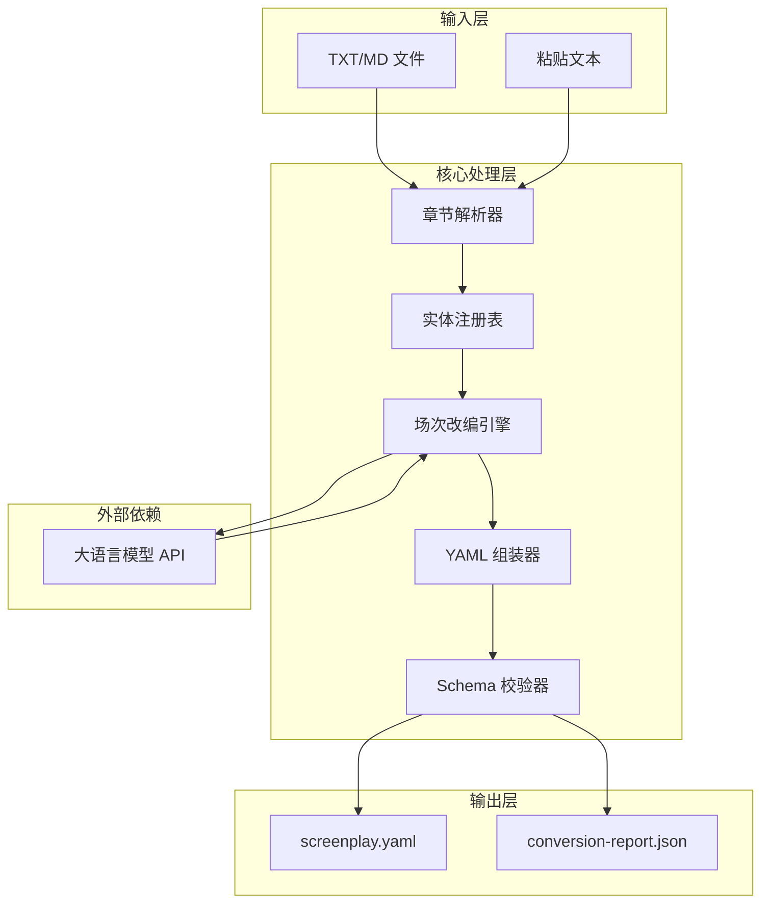
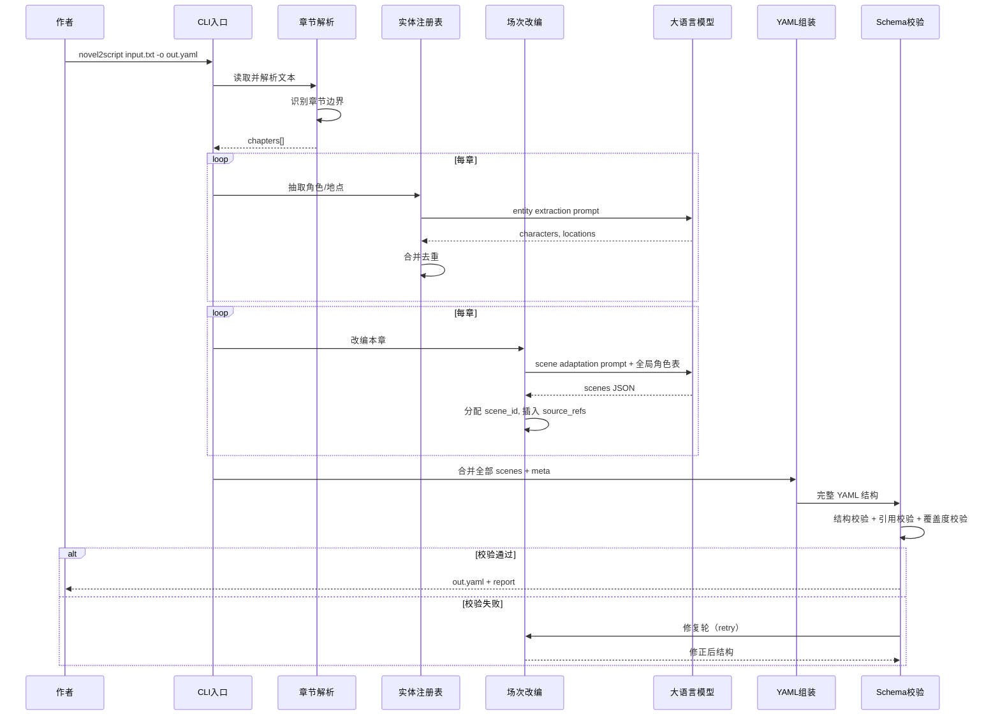
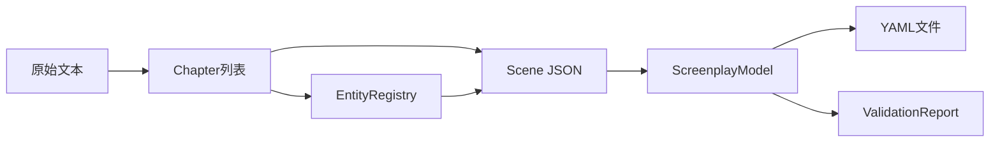
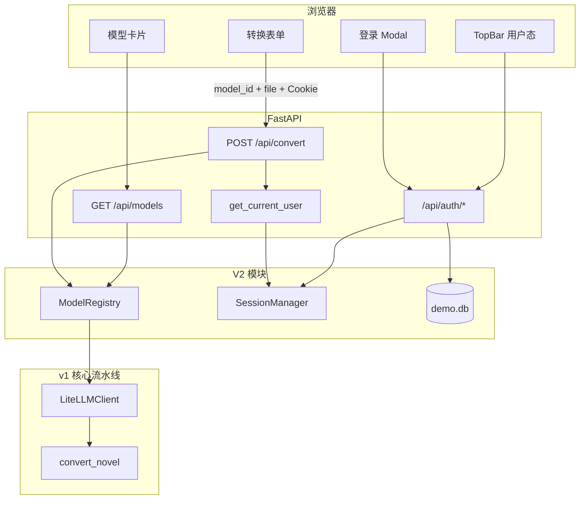

# 技术架构文档

> 版本：2.0  
> 最后更新：2026-06-06  
> V2 详细方案：[V2-TECH-SPEC.md](./V2-TECH-SPEC.md)

---

## 1. 架构概览

Novel2Script 采用 **分阶段 Prompt Chain + 结构化中间表示 + Schema 校验** 的架构，将小说文本流水线式转换为符合规范的 YAML 剧本。



---

## 2. 技术栈选型

| 层级 | 选型 | 版本 | 选型理由 |
|------|------|------|----------|
| 语言 | Python | 3.11+ | LLM/NLP 生态成熟，Pydantic/YAML 库完善 |
| LLM 接入 | LiteLLM / OpenAI SDK | latest | 统一接口，支持多提供商切换 |
| 数据校验 | Pydantic | v2 | 类型安全，可自动生成 JSON Schema |
| YAML 处理 | PyYAML / ruamel.yaml | latest | ruamel.yaml 保留格式与注释 |
| CLI | Typer | latest | 类型提示友好，自动生成帮助 |
| 测试 | pytest | latest | 单元测试 + fixture 回归 |
| HTTP / Web UI | FastAPI + Jinja2 | latest | 异步、服务端渲染 Web UI |
| 认证 Demo | itsdangerous + bcrypt | latest | 签名 Session Cookie |
| 用户存储 Demo | SQLite | 3.x | 单文件 `data/demo.db` |

### 2.1 LLM 提供商支持（V2 五模型）

V2 通过 `ModelRegistry`（`llm/registry.py`）统一管理五款预置模型，运行时按 `model_id` 解析 provider、LiteLLM 模型名、base_url 与 API Key。

| model_id | 提供商 | LiteLLM 模型 | 环境变量 | 适用场景 |
|----------|--------|--------------|----------|----------|
| `openai-gpt-4o-mini` | OpenAI | `gpt-4o-mini` | `OPENAI_API_KEY` / `LLM_API_KEY` | 质量稳定、演示 |
| `qwen-plus` | 通义千问 | `dashscope/qwen-plus` | `DASHSCOPE_API_KEY` | 国内部署、中文理解 |
| `zhipu-glm-5.1` | 智谱 | `zai/glm-5.1` | `ZAI_API_KEY` | 长文本、推理 |
| `kimi-moonshot-32k` | Kimi | `moonshot/moonshot-v1-32k` | `MOONSHOT_API_KEY` | 长上下文改编 |
| `deepseek-chat` | DeepSeek | `deepseek/deepseek-chat` | `DEEPSEEK_API_KEY` | 性价比、中文推理 |

**向后兼容：** CLI 仍支持 v1 的 `LLM_PROVIDER` + `LLM_MODEL`；Ollama 可通过 CLI `--provider ollama` 使用，但不在 V2 Web UI 预置模型卡片中。

Web UI 通过 `GET /api/models` 暴露目录；仅 env Key 已配置的模型标记为 `available`。

---

## 3. 转换流水线

### 3.1 时序图



### 3.2 各阶段说明

| 阶段 | 输入 | 输出 | 职责 |
|------|------|------|------|
| 章节解析 | 原始文本 | `Chapter[]` | 识别章节边界，提取标题与字数 |
| 实体抽取 | 每章文本 | `Character[]`, `Location[]` | LLM 抽取角色/地点，注册表合并消歧 |
| 场次改编 | 每章文本 + 全局实体表 | `Scene[]` | LLM 将章节拆/合为场次，生成 elements |
| YAML 组装 | 全部 Scene + Meta | YAML 字符串 | 按 Schema 顺序序列化 |
| Schema 校验 | YAML 结构 | PASS/FAIL + warnings | Pydantic 校验 + 业务规则 |

---

## 4. 模块设计

### 4.1 目录结构

```
novel2script/
├── src/
│   ├── __init__.py
│   ├── cli/
│   │   └── main.py              # Typer CLI 入口
│   ├── api/                     # FastAPI Web UI（V1 已有，V2 扩展）
│   │   ├── app.py
│   │   ├── routes.py
│   │   ├── templates/
│   │   └── static/
│   ├── auth/                    # V2：登录注册 Demo
│   │   ├── models.py
│   │   ├── database.py
│   │   ├── service.py
│   │   ├── session.py
│   │   ├── deps.py
│   │   └── routes.py
│   ├── parser/
│   │   └── chapter.py
│   ├── extractor/
│   │   └── entity.py
│   ├── adapter/
│   │   ├── scene_adapter.py
│   │   └── prompts.py
│   ├── models/
│   │   └── schema.py
│   ├── emitter/
│   │   └── yaml_writer.py
│   ├── validator/
│   │   └── validate.py
│   ├── pipeline/
│   │   └── converter.py
│   └── llm/
│       ├── client.py            # LiteLLM 统一客户端
│       └── registry.py          # V2：五模型注册表
├── data/
│   └── demo.db                  # V2：SQLite 用户库（运行时生成）
├── tests/
├── examples/
├── docs/
├── pyproject.toml
└── README.md
```

### 4.2 模块职责

#### `parser/chapter.py`

- 正则匹配常见章节标题模式
- 支持自定义章节分隔符配置
- 输出：`List[Chapter(id, title, content, word_count)]`

```python
# 支持的章节模式示例
CHAPTER_PATTERNS = [
    r"^第[零一二三四五六七八九十百千\d]+章\s*(.*)$",
    r"^Chapter\s+(\d+)\s*[:\.]?\s*(.*)$",
    r"^#\s+(.*)$",  # Markdown H1
]
```

#### `extractor/entity.py`

- 调用 LLM 从单章文本抽取角色与地点
- 与全局 Registry 合并：别名匹配、ID 分配
- 输出更新后的 `CharacterRegistry`, `LocationRegistry`

#### `adapter/scene_adapter.py`

- 核心改编逻辑，每章独立调用 LLM
- 输入：章节文本 + 已知角色/地点表 + 改编规则
- 输出：`List[Scene]` JSON，后处理分配 ID 和 source_refs

#### `models/schema.py`

- Pydantic v2 模型，字段与 [YAML-SCHEMA.md](./YAML-SCHEMA.md) 一一对应
- 提供 `model_json_schema()` 供外部工具消费

#### `emitter/yaml_writer.py`

- 使用 ruamel.yaml 保证输出格式可读
- 固定字段顺序：schema_version → meta → characters → locations → acts → scenes → warnings
- 多行文本使用 `|` 块标量

#### `validator/validate.py`

- 调用 Pydantic 模型校验
- 额外业务规则：章节覆盖度、ID 引用完整性
- 返回 `ValidationResult(status, warnings, errors)`

#### `llm/registry.py`（V2）

- 定义 `MODEL_CATALOG` 五模型静态注册表
- `list_models()`：返回全部模型及 `available` 状态（取决于 env Key）
- `resolve(model_id)`：解析为 `ResolvedModel`，供 `build_llm_client()` 使用
- 禁止在 Registry 中硬编码 API Key

#### `auth/`（V2 Demo）

- `service.py`：注册、登录、bcrypt 密码哈希
- `session.py`：`itsdangerous` 签名 Session，HttpOnly Cookie
- `deps.py`：`get_current_user` FastAPI 依赖，保护 `/api/convert`
- `routes.py`：`/api/auth/register|login|logout|me`
- **非生产**：无邮箱验证、OAuth、Refresh Token

#### `api/routes.py`（V2 变更）

- `POST /api/convert` 需登录；接受 `model_id` 表单字段
- 使用 `Settings.model_copy()` 生成请求级配置，避免污染全局 `get_settings()` 缓存
- 新增 `GET /api/models` 路由（或在独立 router 中）

---

## 5. Prompt 策略

### 5.1 System Prompt（全局）

```
你是一位资深影视编剧，擅长将小说改编为可拍摄的剧本。

改编规则：
1. 将小说叙述改写为可视化的动作（action），禁止大段心理描写
2. 保留原文中的直接引语作为对白（dialogue）
3. 无引语的对话需从上下文中合理外化，并标记为 DIALOGUE_SYNTHESIZED
4. 按「时间+地点」变化划分场次（scene）
5. 每场必须包含 slugline（内景/外景 + 地点 + 时间）
6. 内心独白优先转为动作或对白，仅在必要时使用画外音（voiceover）
7. 输出严格遵循指定的 JSON Schema
```

### 5.2 实体抽取 Prompt（每章）

```
从以下小说章节中抽取：
1. 出现的角色（姓名、别名、简要描述）
2. 出现的地点（名称、内/外景）

已知角色表：{existing_characters}
已知地点表：{existing_locations}

若角色/地点已在已知表中，请使用相同 ID。

章节文本：
{chapter_text}

输出 JSON 格式：{"characters": [...], "locations": [...]}
```

### 5.3 场次改编 Prompt（每章）

```
将以下小说章节改编为剧本场次。

已知角色表：{characters}
已知地点表：{locations}
章节 ID：{chapter_id}

章节文本：
{chapter_text}

输出 JSON 格式：
{
  "scenes": [
    {
      "slugline": {"int_ext": "...", "location_id": "...", "time_of_day": "...", "heading": "..."},
      "summary": "...",
      "source_refs": [{"chapter_id": "...", "excerpt": "...", "paragraph_range": [0, 5]}],
      "characters_present": ["char_..."],
      "elements": [
        {"type": "action", "text": "..."},
        {"type": "dialogue", "character_id": "...", "lines": "...", "parenthetical": "..."}
      ]
    }
  ],
  "warnings": [...]
}
```

### 5.4 后处理策略

1. **ID 分配**：全局递增 `scene_001`, `scene_002`, ...
2. **source_refs 补全**：从原文自动截取 excerpt（≤200 字）
3. **warnings 合并**：跨章 warnings 汇总到顶层
4. **重复 slugline 检测**：相邻场次 slugline 相同时标记 `SCENE_MERGED`

---

## 6. 数据流与中间表示



**ScreenplayModel** 是核心中间表示，Pydantic 模型贯穿抽取、改编、校验、序列化全流程，避免多套数据结构转换。

---

## 7. 错误处理与重试

| 错误类型 | 处理策略 |
|----------|----------|
| LLM 返回非 JSON | 重试 1 次，Prompt 追加「仅输出 JSON」 |
| JSON 结构缺失字段 | Schema 修复轮：将错误反馈给 LLM 修正 |
| 章节识别失败 | 返回明确错误，提示用户检查格式 |
| 章节数 < 3 | 拒绝处理，提示最少 3 章 |
| 校验 FAIL | 最多 2 轮修复，仍失败则输出带 error warnings 的 YAML |
| LLM API 超时 | 指数退避重试 3 次 |

---

## 8. 配置项

通过环境变量或 `.env` 文件配置。完整模板见 [V2-TECH-SPEC.md §3](./V2-TECH-SPEC.md#3-环境变量与密钥管理)。

| 变量 | 默认值 | 说明 |
|------|--------|------|
| `DEFAULT_MODEL_ID` | `openai-gpt-4o-mini` | Web UI 默认选中的 model_id |
| `OPENAI_API_KEY` | — | OpenAI API 密钥 |
| `DASHSCOPE_API_KEY` | — | 通义千问 API 密钥 |
| `ZAI_API_KEY` | — | 智谱 API 密钥 |
| `MOONSHOT_API_KEY` | — | Kimi API 密钥 |
| `DEEPSEEK_API_KEY` | — | DeepSeek API 密钥 |
| `LLM_PROVIDER` | `openai` | CLI 向后兼容 |
| `LLM_MODEL` | `gpt-4o-mini` | CLI 向后兼容 |
| `LLM_API_KEY` | — | 向后兼容，等同 `OPENAI_API_KEY` |
| `LLM_BASE_URL` | — | 自定义 API 地址（Ollama 等） |
| `AUTH_SECRET` | — | Session 签名密钥（Web Demo 必填） |
| `AUTH_DEMO_USERS` | — | 可选预置账号 `email:password` |
| `MAX_CHAPTERS` | `20` | 最大处理章节数 |
| `MAX_WORDS` | `100000` | 最大处理字数 |
| `PROMPT_VERSION` | `v1.0` | Prompt 版本号，写入 meta |

---

## 9. 安全与隐私

| concern | 方案 |
|----------|------|
| 原文隐私 | 支持 Ollama 本地部署，数据不出机器 |
| API Key 安全 | 按提供商独立 env 注入；禁止硬编码；日志不记录 Key |
| Key 隔离 | 各 model_id 绑定独立 env_key，Web 不向客户端暴露 Key |
| 输出文件 | 本地写入，不上传云端 |
| 日志 | 不记录原文内容；审计仅记录 user_id + model_id + 耗时 |
| Web 鉴权 | `/api/convert` 需有效 Session；Demo 级 bcrypt + 签名 Cookie |
| Session 安全 | HttpOnly、SameSite=Lax；生产需 HTTPS + Secure Cookie |

---

## 10. 扩展点

| 扩展 | 接口 | 说明 |
|------|------|------|
| 新 LLM 模型 | `llm/registry.py` | 在 `MODEL_CATALOG` 追加条目 |
| 新 LLM 提供商 | `llm/client.py` | 实现 `LLMClient` 协议或扩展 LiteLLM 前缀 |
| 新导出格式 | `emitter/` | 添加 `fountain_writer.py` |
| 新章节格式 | `parser/chapter.py` | 添加 CHAPTER_PATTERNS |
| Web UI | FastAPI router | 复用 core 流水线 |
| 生产级认证 | `auth/` | 替换 Demo 为 OAuth/JWT 等 |

---

## 11. 部署方式

### 11.1 本地 CLI（MVP）

```bash
pip install novel2script
novel2script convert input.txt -o screenplay.yaml
```

### 11.2 Docker（可选）

```dockerfile
FROM python:3.11-slim
WORKDIR /app
COPY . .
RUN pip install .
ENTRYPOINT ["novel2script"]
```

### 11.3 本地 LLM（Ollama）

```bash
export LLM_PROVIDER=ollama
export LLM_MODEL=qwen2.5:14b
export LLM_BASE_URL=http://localhost:11434
novel2script convert input.txt -o screenplay.yaml
```

---

## 12. V2 Web 数据流

V2 在 v1 流水线外包一层 **认证 + 模型选择** 网关，核心改编逻辑不变。



**请求路径摘要：**

1. 页面加载 → `GET /api/auth/me` 确定登录态；`GET /api/models` 渲染模型卡片
2. 未登录用户点击转换 → 弹出 AuthModal
3. 登录成功 → Cookie 写入 → 启用表单
4. 提交转换 → 服务端校验 Session → `ModelRegistry.resolve(model_id)` → 请求级 `Settings` → `convert_novel()`
5. 响应 JSON 含 `yaml_content`、`report`；`meta.adaptation.model` 记录实际 LiteLLM 模型名

UI 设计规范见 [DESIGN-SYSTEM.md](./DESIGN-SYSTEM.md)。
