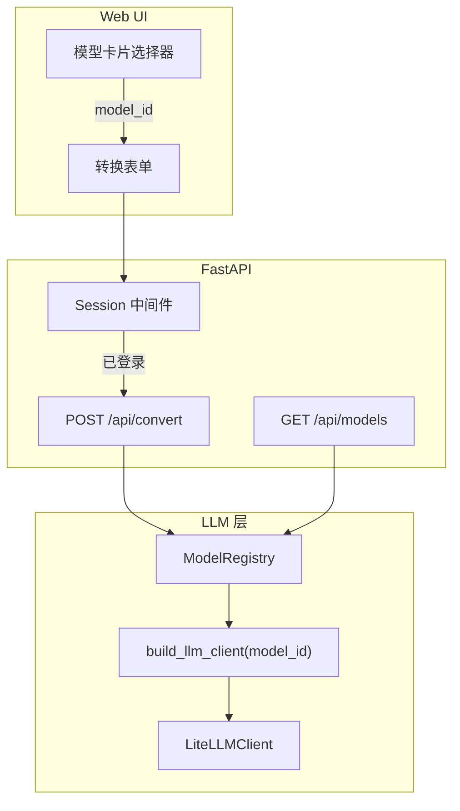
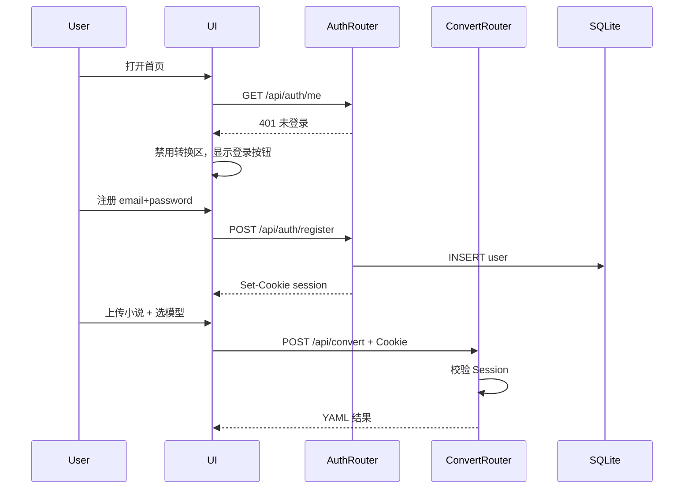

# Novel2Script V2 技术方案

> 版本：2.0  
> 最后更新：2026-06-06  
> 状态：文档定稿（代码待实现）  
> 关联文档：[ARCHITECTURE.md](./ARCHITECTURE.md)、[DESIGN-SYSTEM.md](./DESIGN-SYSTEM.md)、[PRD.md](./PRD.md)

---

## 1. 版本说明与 v1 差异摘要

### 1.1 版本标识

| 维度 | v1.0 | v2.0 |
|------|------|------|
| 产品文档版本 | 1.0 | **2.0** |
| 应用包版本（建议） | 0.1.0 | **0.2.0** |
| YAML 输出 Schema | 1.0 | **1.0（不变）** |
| Prompt 版本 | v1.0 | v1.0（不变） |

### 1.2 v2 核心增量

1. **五模型选择切换模块** — OpenAI、通义千问、智谱 GLM、Kimi、DeepSeek 五家模型可在 Web UI 与 CLI 间切换
2. **用户登录/注册 Demo** — 前后端打通，**未登录不可调用 `/api/convert`**
3. **Web UI 改版** — 延续「纸墨」编辑风，新增顶栏、模型卡片、登录 Modal（详见 [DESIGN-SYSTEM.md](./DESIGN-SYSTEM.md)）

### 1.3 v1 已知缺口（v2 解决）

| 缺口 | v1 现状 | v2 目标 |
|------|---------|---------|
| 模型切换 | Web footer 仅展示默认模型；API 无 `provider` | UI 卡片 + `model_id` 参数 |
| 配置泄漏 | `routes.py` 原地修改 `get_settings()` 缓存 | 请求级 `Settings` 副本 |
| 多 Key | 单一 `LLM_API_KEY` | 按提供商独立环境变量 |
| 认证 | 无 | Session Demo + 转换接口鉴权 |
| 模型目录 | 无 | `GET /api/models` |

### 1.4 明确不在 v2 范围

- Fountain / PDF 导出
- 英文小说支持
- 角色关系图、场次 AI 重写
- 生产级 OAuth / SSO / 邮箱验证

上述功能保留至 V3 路线图。

---

## 2. 五模型注册表与 LiteLLM 映射

### 2.1 模型目录

实现层位于 `src/novel2script/llm/registry.py`（待建），定义 `MODEL_CATALOG`：

| model_id | 显示名 | provider | LiteLLM model | base_url | env_key | 推荐场景 |
|----------|--------|----------|---------------|----------|---------|----------|
| `openai-gpt-4o-mini` | GPT-4o Mini | `openai` | `gpt-4o-mini` | （默认） | `OPENAI_API_KEY` 或 `LLM_API_KEY` | 质量稳定、演示 |
| `qwen-plus` | 通义千问 Plus | `dashscope` | `dashscope/qwen-plus` | `https://dashscope.aliyuncs.com/compatible-mode/v1` | `DASHSCOPE_API_KEY` | 国内部署、中文理解 |
| `zhipu-glm-5.1` | 智谱 GLM-5.1 | `zai` | `zai/glm-5.1` | `https://open.bigmodel.cn/api/paas/v4` | `ZAI_API_KEY` | 长文本、推理 |
| `kimi-moonshot-32k` | Kimi 32K | `moonshot` | `moonshot/moonshot-v1-32k` | `https://api.moonshot.cn/v1` | `MOONSHOT_API_KEY` | 长上下文改编 |
| `deepseek-chat` | DeepSeek Chat | `deepseek` | `deepseek/deepseek-chat` | `https://api.deepseek.com` | `DEEPSEEK_API_KEY` | 性价比、中文推理 |

### 2.2 LiteLLM 集成原则

现有 `LiteLLMClient`（`src/novel2script/llm/client.py`）继续作为统一调用层，**不为各厂商单独实现 HTTP Client**。智谱官方 `requests` 示例仅作 API 参考；实现仍通过 LiteLLM 的 provider 前缀调用。

各厂商 LiteLLM 前缀：

| 厂商 | LiteLLM 前缀 | 官方文档 |
|------|--------------|----------|
| OpenAI | （无前缀） | https://platform.openai.com/docs |
| 通义千问 | `dashscope/` | [OpenAI 兼容模式](https://help.aliyun.com/zh/model-studio/developer-reference/compatibility-of-openai-with-dashscope) |
| 智谱 | `zai/` | [智谱 Chat API](https://open.bigmodel.cn/dev/api#chat) |
| Kimi | `moonshot/` | [Moonshot API](https://platform.moonshot.cn/docs/api/chat) |
| DeepSeek | `deepseek/` | [DeepSeek API](https://platform.deepseek.com/api-docs/) |

### 2.3 Registry 数据结构（Pydantic 草案）

```python
class ModelEntry(BaseModel):
    id: str
    display_name: str
    provider: str
    litellm_model: str
    base_url: str | None = None
    env_key: str
    description: str = ""
    accent_color: str = ""  # UI 用，见 DESIGN-SYSTEM.md

class ResolvedModel(BaseModel):
    id: str
    provider: str
    model: str          # LiteLLM 完整名，如 dashscope/qwen-plus
    api_key: str
    base_url: str | None
```

### 2.4 Registry API（内部）

| 方法 | 说明 |
|------|------|
| `list_models()` | 返回全部 4 项，`available` 取决于 env_key 是否已配置 |
| `resolve(model_id)` | 解析为 `ResolvedModel`；Key 缺失时抛 `ModelNotConfiguredError` |
| `get_default_model_id()` | 读取 `DEFAULT_MODEL_ID`，回退 `openai-gpt-4o-mini` |

---

## 3. 环境变量与密钥管理

### 3.1 完整 `.env` 模板

```env
# 默认模型（五选一 model_id）
DEFAULT_MODEL_ID=openai-gpt-4o-mini

# 各提供商 API Key（按需填写；未配置则 UI 隐藏对应模型）
OPENAI_API_KEY=
LLM_API_KEY=                    # 向后兼容，等同 OPENAI_API_KEY
DASHSCOPE_API_KEY=
ZAI_API_KEY=
MOONSHOT_API_KEY=
DEEPSEEK_API_KEY=

# 向后兼容 v1 配置（CLI 仍可用）
LLM_PROVIDER=openai
LLM_MODEL=gpt-4o-mini

# Auth Demo
AUTH_SECRET=change-me-in-production
AUTH_DEMO_USERS=admin@demo.local:demo123   # 可选：预置账号 email:password

# 处理限制
MAX_CHAPTERS=20
MAX_WORDS=100000
PROMPT_VERSION=v1.0
```

### 3.2 安全要求

- API Key **仅通过 `.env` 或部署环境注入**，禁止写入源代码、文档示例或 Git 仓库
- `.env.example` 只保留占位符
- 日志与转换报告**不记录** API Key 或原文内容
- 若 Key 曾在非安全渠道暴露，**立即在对应平台轮换**
- Auth Demo 的 `AUTH_SECRET` 在生产部署时必须更换为强随机值

### 3.3 各厂商配置对照（Key 均为占位符）

#### OpenAI

```python
from openai import OpenAI

client = OpenAI(api_key="sk-your-openai-key")
# model: gpt-4o-mini
```

#### 通义千问（DashScope 兼容模式）

```python
import os
from openai import OpenAI

client = OpenAI(
    api_key=os.getenv("DASHSCOPE_API_KEY"),
    base_url="https://dashscope.aliyuncs.com/compatible-mode/v1",
)
# model: qwen-plus
# 模型列表: https://help.aliyun.com/zh/model-studio/getting-started/models
```

#### Kimi（Moonshot）

```python
from openai import OpenAI

client = OpenAI(
    api_key=os.getenv("MOONSHOT_API_KEY"),
    base_url="https://api.moonshot.cn/v1",
)
# LiteLLM: moonshot/moonshot-v1-32k
```

#### 智谱 GLM（官方 REST 参考；实现走 LiteLLM）

```python
# 官方 REST 示例（仅供参考）
import requests

def call_zhipu_api(messages, model="glm-5.1"):
    url = "https://open.bigmodel.cn/api/paas/v4/chat/completions"
    headers = {
        "Authorization": "Bearer YOUR_API_KEY",
        "Content-Type": "application/json",
    }
    data = {"model": model, "messages": messages, "temperature": 1.0}
    response = requests.post(url, headers=headers, json=data)
    response.raise_for_status()
    return response.json()

# LiteLLM 等价调用: model="zai/glm-5.1", api_key=ZAI_API_KEY
```

#### DeepSeek（OpenAI 兼容）

```python
from openai import OpenAI

client = OpenAI(
    api_key=os.getenv("DEEPSEEK_API_KEY"),
    base_url="https://api.deepseek.com",
)
# model: deepseek-chat（亦可用 deepseek-reasoner）
# LiteLLM: deepseek/deepseek-chat
```

---

## 4. 模型切换模块

### 4.1 架构图



### 4.2 请求级配置流程

修复 v1 中 `get_settings()` 全局 mutation 问题：

1. 客户端提交 `model_id`（非裸 `model` 字符串）
2. `ModelRegistry.resolve(model_id)` → `ResolvedModel`
3. `base_settings.model_copy(update={ llm_provider, llm_model, llm_api_key, llm_base_url })`
4. `LiteLLMClient(request_settings)` 传入 `convert_novel()`
5. 输出 `meta.adaptation.model` 写入 LiteLLM 完整名

### 4.3 Factory 函数（草案）

```python
def build_llm_client(model_id: str, base_settings: Settings | None = None) -> LiteLLMClient:
    settings = base_settings or get_settings()
    resolved = ModelRegistry.resolve(model_id)
    request_settings = settings.model_copy(update={
        "llm_provider": resolved.provider,
        "llm_model": resolved.model,
        "llm_api_key": resolved.api_key,
        "llm_base_url": resolved.base_url,
    })
    return LiteLLMClient(request_settings)
```

### 4.4 HTTP API 变更

| 方法 | 路径 | 鉴权 | 说明 |
|------|------|------|------|
| GET | `/api/models` | 无 | `{ models: [{ id, name, provider, available, description }] }` |
| POST | `/api/convert` | **需登录** | 新增 `model_id` 表单字段；移除对全局 settings 的原地修改 |
| POST | `/api/auth/register` | 无 | `{ email, password }` → Set-Cookie |
| POST | `/api/auth/login` | 无 | `{ email, password }` → Set-Cookie |
| POST | `/api/auth/logout` | 需登录 | 清除 Session |
| GET | `/api/auth/me` | 需登录 | `{ id, email, created_at }` |

#### GET /api/models 响应示例

```json
{
  "models": [
    {
      "id": "qwen-plus",
      "name": "通义千问 Plus",
      "provider": "dashscope",
      "available": true,
      "description": "国内部署、中文理解"
    },
    {
      "id": "zhipu-glm-5.1",
      "name": "智谱 GLM-5.1",
      "provider": "zai",
      "available": false,
      "description": "长文本、推理"
    }
  ],
  "default_model_id": "openai-gpt-4o-mini"
}
```

#### POST /api/convert 变更

- **新增** Form 字段：`model_id: str`（默认 `DEFAULT_MODEL_ID`）
- **废弃**（保留兼容一版）：裸 `model` 字段
- **鉴权**：未登录返回 `401 Unauthorized`
- **错误**：`model_id` 对应 Key 未配置 → `503 Service Unavailable`

### 4.5 CLI 变更

```bash
# v2 推荐用法
novel2script convert input.txt -o out.yaml --model-id qwen-plus

# v1 向后兼容
novel2script convert input.txt -o out.yaml --provider dashscope --model qwen-plus
```

`ConversionOptions` 扩展字段：`model_id: str | None`

---

## 5. 认证 Demo 模块

### 5.1 设计原则

本模块为 **Demo 级别**，标注「非生产」，用于演示登录后才能使用转换功能的完整链路。

### 5.2 时序图



### 5.3 模块结构

```
src/novel2script/auth/
├── models.py      # User SQLAlchemy / Pydantic 模型
├── database.py    # SQLite 连接，data/demo.db
├── service.py     # register / login / verify_password
├── session.py     # itsdangerous 签名 Session
├── deps.py        # get_current_user FastAPI Depends
└── routes.py      # /api/auth/* 路由
```

### 5.4 数据模型

**users 表**

| 字段 | 类型 | 说明 |
|------|------|------|
| id | INTEGER PK | 自增 |
| email | TEXT UNIQUE | 登录名 |
| password_hash | TEXT | bcrypt |
| created_at | DATETIME | 注册时间 |

**conversion_logs 表（审计，可选）**

| 字段 | 类型 | 说明 |
|------|------|------|
| id | INTEGER PK | |
| user_id | INTEGER FK | |
| model_id | TEXT | 使用的模型 |
| duration_sec | REAL | 耗时 |
| status | TEXT | success / error |
| created_at | DATETIME | |

不存储原文内容。

### 5.5 Session 机制

- 使用 `itsdangerous.URLSafeTimedSerializer` + `AUTH_SECRET`
- Cookie 名：`novel2script_session`
- 属性：`HttpOnly`, `SameSite=Lax`, `Max-Age=86400`（24h）
- Payload：`{ user_id, email, exp }`

### 5.6 Demo 范围边界

| 能力 | Demo 实现 | 明确不做 |
|------|-----------|----------|
| 用户存储 | SQLite `data/demo.db` | 分布式用户中心 |
| 密码 | bcrypt 哈希 | 邮箱验证、找回密码 |
| 会话 | 签名 Cookie | OAuth、SSO、Refresh Token |
| 限流 | 每用户每日 10 次转换（可配置） | 计费系统 |
| 审计 | user_id + model_id + 耗时 | 原文落库 |

### 5.7 预置账号

通过 `AUTH_DEMO_USERS=email:password,email2:password2` 在启动时 seed，便于演示。

---

## 6. Web UI 改版

详细设计规范见 [DESIGN-SYSTEM.md](./DESIGN-SYSTEM.md)。

### 6.1 页面结构

单页应用（Jinja2 服务端渲染 + 原生 JS），`max-width: 960px`：

1. **TopBar** — Logo + 用户态 / 登录按钮
2. **Hero** — 三步流程（继承 v1）
3. **ModelSelector** — 响应式模型卡片网格（≥640px 为 3 列，窄屏 1 列；共 5 张卡片）
4. **ConvertPanel** — 转换表单（未登录禁用）
5. **ResultPanel** — 结果展示（继承 v1）
6. **Footer** — Schema v1.0 · 当前模型 · 登录用户
7. **AuthModal** — 登录/注册 Tab 切换

### 6.2 新增静态资源

| 文件 | 职责 |
|------|------|
| `templates/partials/topbar.html` | 顶栏 |
| `templates/partials/model-selector.html` | 模型卡片 |
| `templates/partials/auth-modal.html` | 登录注册 Modal |
| `static/auth.js` | 会话检测、Modal、Cookie 请求 |
| `static/models.js` | 拉取 `/api/models`、渲染卡片、localStorage 记忆 |
| `static/app.css` | 扩展顶栏、模型网格、Modal、禁用态 |

### 6.3 交互规则

- 未登录：转换表单 `opacity: 0.5; pointer-events: none`；点击「开始转换」弹出 AuthModal
- 已登录：`localStorage` 记住上次 `model_id`
- `available=false`：卡片置灰 + tooltip「管理员未配置此模型」
- 转换中：锁定模型选择与表单

---

## 7. CLI 变更摘要

| 命令 | 变更 |
|------|------|
| `convert` | 新增 `--model-id`；与 `--provider`/`--model` 互斥时 `--model-id` 优先 |
| `serve` | 启动时初始化 SQLite、seed 预置用户、挂载 auth 路由 |
| `validate` | 无变更 |

---

## 8. 测试策略

### 8.1 单元测试

| 模块 | 测试点 |
|------|--------|
| `llm/registry.py` | 五模型解析、Key 缺失检测、default 回退 |
| `auth/service.py` | 注册、登录、密码校验、重复邮箱 |
| `auth/session.py` | 签名/验签、过期 |

### 8.2 集成测试

| 场景 | 断言 |
|------|------|
| 未登录 convert | HTTP 401 |
| 注册→登录→convert | HTTP 200 + yaml_content |
| 切换 model_id | `meta.adaptation.model` 正确 |
| Key 未配模型 | HTTP 503 或 UI 不可选 |

### 8.3 Mock 策略

- 默认 `pytest` 仍使用 `MockLLMClient`，无需真实 Key
- 新增 `tests/test_auth.py`、`tests/test_model_registry.py`
- 各 provider smoke test：`pytest -m integration`（需对应 Key）

---

## 9. 部署注意事项

1. 配置五个 env_key 中至少一个，否则 Web UI 无可用模型
2. 设置强随机 `AUTH_SECRET`
3. `data/demo.db` 需可写（Docker 挂载 volume）
4. 生产环境应启用 HTTPS（Cookie Secure 标志）
5. 反向代理超时建议 ≥ 300s（长文本转换）

---

## 10. 迁移指南（v1 → v2）

### 10.1 配置迁移

| v1 | v2 |
|----|-----|
| `LLM_API_KEY=sk-xxx` | `OPENAI_API_KEY=sk-xxx`（或保留 `LLM_API_KEY`） |
| `LLM_PROVIDER=dashscope` | 配置 `DASHSCOPE_API_KEY` + Web 选 `qwen-plus` |
| `LLM_PROVIDER=deepseek` | 配置 `DEEPSEEK_API_KEY` + Web 选 `deepseek-chat` |
| 无 | 新增 `DEFAULT_MODEL_ID`、`AUTH_SECRET` |

### 10.2 API 迁移

- Web 客户端需在 convert 请求前完成登录
- convert 表单新增 `model_id` 字段
- 可继续调用 `GET /api/health`（无变更）

### 10.3 行为变更

- **破坏性**：`/api/convert` 默认需登录（v1 为公开）
- **非破坏性**：CLI 无需登录；YAML Schema 不变

---

## 11. 附录：官方文档链接

| 厂商 | 文档 | Base URL |
|------|------|----------|
| OpenAI | https://platform.openai.com/docs/api-reference | 默认 |
| 通义千问 | https://help.aliyun.com/zh/model-studio/getting-started/models | `https://dashscope.aliyuncs.com/compatible-mode/v1` |
| Kimi | https://platform.moonshot.cn/docs/api/chat | `https://api.moonshot.cn/v1` |
| 智谱 | https://open.bigmodel.cn/dev/api#chat | `https://open.bigmodel.cn/api/paas/v4` |
| DeepSeek | https://platform.deepseek.com/api-docs/ | `https://api.deepseek.com` |
| LiteLLM DashScope | https://docs.litellm.ai/docs/providers/dashscope | — |
| LiteLLM Moonshot | https://docs.litellm.ai/docs/providers/moonshot | — |
| LiteLLM Z.AI | https://docs.litellm.ai/docs/providers/zai | — |
| LiteLLM DeepSeek | https://docs.litellm.ai/docs/providers/deepseek | — |

---

## 12. 验收标准

### 文档阶段（当前）

- [x] V2-TECH-SPEC 与 ARCHITECTURE、DESIGN-SYSTEM 交叉引用一致
- [x] 五模型配置表与官方 API 对齐
- [x] 安全章节明确禁止硬编码 Key
- [x] 版本号统一为 2.0

### 代码阶段（后续）

- [ ] 未登录 `POST /api/convert` → 401
- [ ] 注册→登录→选模型→转换全链路通过
- [ ] 切换五模型后 `meta.adaptation.model` 正确
- [ ] `GET /api/models` 仅标记 Key 已配置者为 available
- [ ] pytest 默认无需真实 Key
